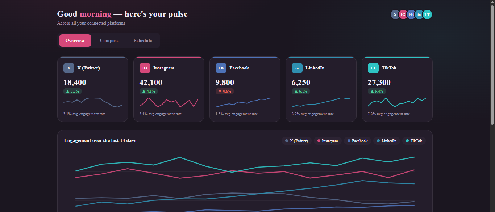

# 📊 Social Pulse — Multi-Channel Social Analytics & Content Hub

[](https://github.com/)
[](https://opensource.org/licenses/MIT)
[](https://github.com/)

> **"Unified social metrics, audience trends, and content management in one pulse."**

**Social Pulse** is a client-side social media management dashboard built with native web technologies. Designed for digital marketers, content creators, and brand agencies, it aggregates live performance metrics, engagement rates, and growth trends across major social channels (X / Twitter, Instagram, Facebook, LinkedIn, TikTok) into a dark neon aesthetic workspace.

[Explore Live Workspace](https://yourusername.github.io/social-pulse) • [Report a Bug](https://github.com/yourusername/social-pulse/issues) • [Request Feature](https://github.com/yourusername/social-pulse/issues)

---

## 📸 Interface Preview & Gallery

### Multi-Platform Analytics Dashboard & Performance Trends
<!-- Replace this placeholder URL with your real cropped screenshot once uploaded to GitHub -->


### 🎥 Interactive Dashboard Walkthrough
> **Watch Social Pulse in action:** Click the workspace preview below to see dynamic tab switching (`Overview`, `Compose`, `Schedule`), chart hover interactions, channel metric filtering, and dark mode optimizations in real time.

[](https://github.com/yourusername/social-pulse "Watch Walkthrough")

---

## ✨ Core Engineering & Feature Set

* **🌐 Multi-Channel Integration:** Centralized monitoring cards for key channels:
  * 𝕏 **X (Twitter):** Total followers, growth delta (`▲ 2.3%`), micro sparklines, avg engagement (`3.1%`).
  * 📸 **Instagram:** Audience reach, growth rate (`▲ 4.8%`), engagement metrics (`5.4%`).
  * 📘 **Facebook:** Page likes, metric variance (`▼ 0.6%`), historical trend vectors.
  * 💼 **LinkedIn:** Professional network growth (`▲ 6.1%`), engagement analytics (`2.9%`).
  * 🎵 **TikTok:** Video audience scale (`▲ 9.4%`), peak engagement tracking (`7.2%`).
* **📈 Dynamic 14-Day Engagement Chart:** Multi-series SVG/Canvas trend graph displaying synchronized performance lines per social network with custom color-coded brand indicators.
* **🗂️ Workflow Tab Navigation:** Integrated top-level view switching:
  * **Overview:** High-level platform KPIs and historical charts.
  * **Compose:** Content creation studio for drafting multi-platform updates.
  * **Schedule:** Visual calendar manager for queueing upcoming posts.
* **⚡ Sparkline Visualization Nodes:** Mini inline trend graphs embedded inside individual platform cards for instant visual comparison.
* **🎨 Modern Neon Dark Theme:** Premium slate/black backdrop (`#0d0d12`) paired with vibrant brand color accents, subtle glassmorphic borders, and responsive card grids.

---

## 🛠 Tech Stack Matrix

| Module | Selected Technologies | Architectural Mandate |
| :--- | :--- | :--- |
| **Structure** | HTML5 | Accessible dashboard layouts, metric cards, tab navigation controls, canvas elements |
| **Styling** | CSS3 Grid / Flexbox | Dark mode color variables, custom glassmorphism, fluid responsive grid design |
| **Engine** | Vanilla JavaScript | Dynamic metric data rendering, tab switching state logic, chart initialization/updates |

---

## 📦 Rapid Local Setup

### 1. Repository Clone
```bash
[git clone [https://github.com/yourusername/social-pulse.git](https://github.com/yourusername/social-pulse.git)
cd social-pulse](https://github.com/Fanuel-Dev/social-media-dashboard.git)
